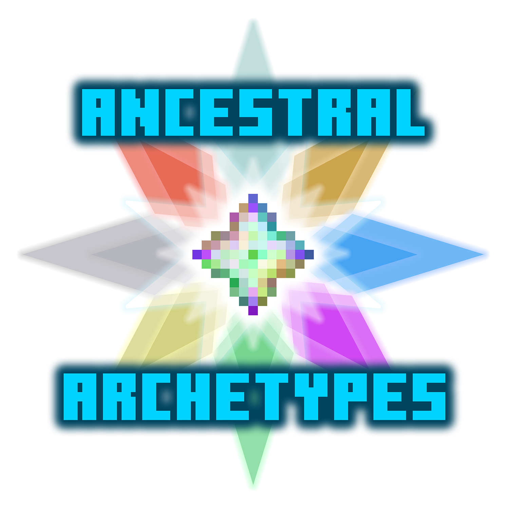

A server-sided Origins-style mod where players pick mob-based Archetypes to gain different abilities.
The mod is highly configurable and balanced around a competitive environment. This mod also has full translation support.

[![Ancestral Archetypes](https://img.shields.io/badge/dynamic/json?labelColor=black&color=grey&label=&query=title&url=https://api.modrinth.com/v2/project/xHHbHfVj&style=flat&logo=data:image/png;base64,iVBORw0KGgoAAAANSUhEUgAAACAAAAAgCAMAAABEpIrGAAAAIGNIUk0AAHomAACAhAAA+gAAAIDoAAB1MAAA6mAAADqYAAAXcJy6UTwAAAJPUExURQAAABvZahWnUha1WAYzGQlHIxvZahvZahvZahvZahvZahvZahvZahvZahvZahvZahvZahvZahvZahvZahvZahvZahvZahvZahvZahvZahvZahvZahvZahvZahvZahvZahvZahvZahvZahvZahvZahvZahvZahvZahvZahvZahvZahvZahvZahvZahvZahvZahvZahvZahvZahvZahvZahvZahvZahvZahvZahvZahvZahvZahvZahvZahvZahvZahvZahvZahvZahvZahvZahvZahvZahvZahvZahvZahvZahvZahvZahvZahvZahvZahvZahvZahvZahvZahvZahvZahvZahvZahvZahvZahvZahvZahvZahvZahvZahvZahvZahvZahvZahvZahvZahvZahvZahvZahvZahvZahvZahvZahvZahvZahvZahvZahvZahvZahvZahvZahvZahvZahvZahvZahvZahvZahvZahvZahvZahvZahvZahvZahvZahvZahvZahvZahvZahvZahvZahvZahvZahvZahvZahvZahvZahvZahvZahvZahvZahvZahvZahvZahvZahvZahvZahvZahvZahvZahvZahvZahvZahvZahvZahvZahvZahvZahvZahvZahvZahvZahvZahvZahvZahvZahvZahvZahvZahvZahvZahvZahvZahvZahvZahvZahvZahvZahvZahvZahvZahvZahvZahvZahvZahvZahvZahvZahvZahvZahvZahvZav///9ScwmYAAADDdFJOUwAAAAAAAA8zW3uOYwIBK3rB6Pn+ml18KiGL5HEDquOIH07R/UzKz2zu+uLHIibtafWkVCMNBRqg7/RQuT8EQbvT+5ETDBSU/NAgCSdZlcQKii7mtxJY5fF/7D1SRkB+EcWh4UilOOtPMdTCR1PqN969vmGDCw7G4DSSsAcGHrSPr3bds5CEwDKoXumcZdwcG4KmjayX32A79pjOqRjIFoXynVYVgPi6qxDnL78p2obVJFquNbGZCPdyvHPZ1yhuh8s+iRzcsrEAAAABYktHRMQUDBvhAAAAB3RJTUUH5wQXDwgZWDUtiQAAAqRJREFUOMttU/k7lFEU/k4L4hsxtNAnhRgiJZOiSfbI2oJpmRFCi2kV0aaNVLTIEpVISmnf97r/WO+534yZnqfzw73vOe+559xz7rmKIoVYvLx95vj6qUSqVBW3sGrwnxsQaAwSwcDz5i9g0wxPfmFIqJCyiEgLE4vDl7iD8PGlETotIqOQahlAdJTLA5sWY5JsbNzysHiihEBWViRqRDOlgyFmJVtMq5JWJ5vhvyZlLevrEmUILKl8PihtvYWcYt6QLmNwFjjEb4SSkZnlZLO5yJzcPBg35bODwZfPZxYwWbC5sKjYzwBUkssxSg1wKNsCtHUb89vTy3GwopBxDmcJ9YdDJYB1B9t2WmUtcbtkqt18Mxsp9irsezS2VEu+uka/mqUWSrFd2VsnhLEetoZ9TFv3HwCexdUdjBWi0aH4YTuEvtoPM3/EO1nnuTpEjD2qHIM54DhR0wmA5hZySzIntyknsbZyi8IB0tp07tRpBDKfgeWsdDjHDlFGRIjnl3O0t573gcMFUBeVS1gvlxB1dOZxv0pIu9IF01UDZRdjr1SuZQhxvbvnRrmsMePmrdsrGPRaKP8OLtmn9KM7A4N3xb8yNExUb5RlZt2btpZbXajzPoYkBaDKrtADp3HkYdloo56ndgx37UcHxSP0tIWBGH9cg1nx6TJFTNhS7eCfcA1PJ+GgDbLDs2GuX3V05Ohj0xYSBGumyq/yfApw4EWTRxPJqxQvIF6+ks9Gr0d4nN+8Nbhoi+NdJEwVSc6hVNvHOUvg+5qeDxoP3GQz6x8/qXLuZ6Op7SPy+gNTnydSELabk1Z8Mbs/hlr4dbobfUgxJMS3UdXza9H33jqnA3/OH41FCZ7/l7HW8vOXiWc9GvPf06D953/T2O/EP8HBNtcH0Zm/lqFNUgTAex4AAAAldEVYdGRhdGU6Y3JlYXRlADIwMjMtMDQtMjNUMTU6MDg6MjQrMDA6MDAE5dOaAAAAJXRFWHRkYXRlOm1vZGlmeQAyMDIzLTA0LTIzVDE1OjA4OjI0KzAwOjAwdbhrJgAAACh0RVh0ZGF0ZTp0aW1lc3RhbXAAMjAyMy0wNC0yM1QxNTowODoyNSswMDowMITaQU0AAAAASUVORK5CYII=)](https://modrinth.com/mod/ancestral-archetypes)
[![Downloads](https://img.shields.io/badge/dynamic/json?labelColor=black&color=grey&label=&suffix=%20downloads&query=downloads&url=https://api.modrinth.com/v2/project/xHHbHfVj&style=flat&logo=data:image/png;base64,iVBORw0KGgoAAAANSUhEUgAAACAAAAAgCAMAAABEpIrGAAAAIGNIUk0AAHomAACAhAAA+gAAAIDoAAB1MAAA6mAAADqYAAAXcJy6UTwAAAJPUExURQAAABvZahWnUha1WAYzGQlHIxvZahvZahvZahvZahvZahvZahvZahvZahvZahvZahvZahvZahvZahvZahvZahvZahvZahvZahvZahvZahvZahvZahvZahvZahvZahvZahvZahvZahvZahvZahvZahvZahvZahvZahvZahvZahvZahvZahvZahvZahvZahvZahvZahvZahvZahvZahvZahvZahvZahvZahvZahvZahvZahvZahvZahvZahvZahvZahvZahvZahvZahvZahvZahvZahvZahvZahvZahvZahvZahvZahvZahvZahvZahvZahvZahvZahvZahvZahvZahvZahvZahvZahvZahvZahvZahvZahvZahvZahvZahvZahvZahvZahvZahvZahvZahvZahvZahvZahvZahvZahvZahvZahvZahvZahvZahvZahvZahvZahvZahvZahvZahvZahvZahvZahvZahvZahvZahvZahvZahvZahvZahvZahvZahvZahvZahvZahvZahvZahvZahvZahvZahvZahvZahvZahvZahvZahvZahvZahvZahvZahvZahvZahvZahvZahvZahvZahvZahvZahvZahvZahvZahvZahvZahvZahvZahvZahvZahvZahvZahvZahvZahvZahvZahvZahvZahvZahvZahvZahvZahvZahvZahvZahvZahvZahvZahvZahvZahvZahvZahvZahvZahvZahvZahvZahvZahvZahvZahvZahvZahvZav///9ScwmYAAADDdFJOUwAAAAAAAA8zW3uOYwIBK3rB6Pn+ml18KiGL5HEDquOIH07R/UzKz2zu+uLHIibtafWkVCMNBRqg7/RQuT8EQbvT+5ETDBSU/NAgCSdZlcQKii7mtxJY5fF/7D1SRkB+EcWh4UilOOtPMdTCR1PqN969vmGDCw7G4DSSsAcGHrSPr3bds5CEwDKoXumcZdwcG4KmjayX32A79pjOqRjIFoXynVYVgPi6qxDnL78p2obVJFquNbGZCPdyvHPZ1yhuh8s+iRzcsrEAAAABYktHRMQUDBvhAAAAB3RJTUUH5wQXDwgZWDUtiQAAAqRJREFUOMttU/k7lFEU/k4L4hsxtNAnhRgiJZOiSfbI2oJpmRFCi2kV0aaNVLTIEpVISmnf97r/WO+534yZnqfzw73vOe+559xz7rmKIoVYvLx95vj6qUSqVBW3sGrwnxsQaAwSwcDz5i9g0wxPfmFIqJCyiEgLE4vDl7iD8PGlETotIqOQahlAdJTLA5sWY5JsbNzysHiihEBWViRqRDOlgyFmJVtMq5JWJ5vhvyZlLevrEmUILKl8PihtvYWcYt6QLmNwFjjEb4SSkZnlZLO5yJzcPBg35bODwZfPZxYwWbC5sKjYzwBUkssxSg1wKNsCtHUb89vTy3GwopBxDmcJ9YdDJYB1B9t2WmUtcbtkqt18Mxsp9irsezS2VEu+uka/mqUWSrFd2VsnhLEetoZ9TFv3HwCexdUdjBWi0aH4YTuEvtoPM3/EO1nnuTpEjD2qHIM54DhR0wmA5hZySzIntyknsbZyi8IB0tp07tRpBDKfgeWsdDjHDlFGRIjnl3O0t573gcMFUBeVS1gvlxB1dOZxv0pIu9IF01UDZRdjr1SuZQhxvbvnRrmsMePmrdsrGPRaKP8OLtmn9KM7A4N3xb8yNExUb5RlZt2btpZbXajzPoYkBaDKrtADp3HkYdloo56ndgx37UcHxSP0tIWBGH9cg1nx6TJFTNhS7eCfcA1PJ+GgDbLDs2GuX3V05Ohj0xYSBGumyq/yfApw4EWTRxPJqxQvIF6+ks9Gr0d4nN+8Nbhoi+NdJEwVSc6hVNvHOUvg+5qeDxoP3GQz6x8/qXLuZ6Op7SPy+gNTnydSELabk1Z8Mbs/hlr4dbobfUgxJMS3UdXza9H33jqnA3/OH41FCZ7/l7HW8vOXiWc9GvPf06D953/T2O/EP8HBNtcH0Zm/lqFNUgTAex4AAAAldEVYdGRhdGU6Y3JlYXRlADIwMjMtMDQtMjNUMTU6MDg6MjQrMDA6MDAE5dOaAAAAJXRFWHRkYXRlOm1vZGlmeQAyMDIzLTA0LTIzVDE1OjA4OjI0KzAwOjAwdbhrJgAAACh0RVh0ZGF0ZTp0aW1lc3RhbXAAMjAyMy0wNC0yM1QxNTowODoyNSswMDowMITaQU0AAAAASUVORK5CYII=)](https://modrinth.com/mod/ancestral-archetypes)
[![Followers](https://img.shields.io/badge/dynamic/json?labelColor=black&color=grey&label=&suffix=%20followers&query=followers&url=https://api.modrinth.com/v2/project/xHHbHfVj&style=flat&logo=data:image/png;base64,iVBORw0KGgoAAAANSUhEUgAAACAAAAAgCAMAAABEpIrGAAAAIGNIUk0AAHomAACAhAAA+gAAAIDoAAB1MAAA6mAAADqYAAAXcJy6UTwAAAJPUExURQAAABvZahWnUha1WAYzGQlHIxvZahvZahvZahvZahvZahvZahvZahvZahvZahvZahvZahvZahvZahvZahvZahvZahvZahvZahvZahvZahvZahvZahvZahvZahvZahvZahvZahvZahvZahvZahvZahvZahvZahvZahvZahvZahvZahvZahvZahvZahvZahvZahvZahvZahvZahvZahvZahvZahvZahvZahvZahvZahvZahvZahvZahvZahvZahvZahvZahvZahvZahvZahvZahvZahvZahvZahvZahvZahvZahvZahvZahvZahvZahvZahvZahvZahvZahvZahvZahvZahvZahvZahvZahvZahvZahvZahvZahvZahvZahvZahvZahvZahvZahvZahvZahvZahvZahvZahvZahvZahvZahvZahvZahvZahvZahvZahvZahvZahvZahvZahvZahvZahvZahvZahvZahvZahvZahvZahvZahvZahvZahvZahvZahvZahvZahvZahvZahvZahvZahvZahvZahvZahvZahvZahvZahvZahvZahvZahvZahvZahvZahvZahvZahvZahvZahvZahvZahvZahvZahvZahvZahvZahvZahvZahvZahvZahvZahvZahvZahvZahvZahvZahvZahvZahvZahvZahvZahvZahvZahvZahvZahvZahvZahvZahvZahvZahvZahvZahvZahvZahvZahvZahvZahvZahvZahvZahvZahvZahvZahvZav///9ScwmYAAADDdFJOUwAAAAAAAA8zW3uOYwIBK3rB6Pn+ml18KiGL5HEDquOIH07R/UzKz2zu+uLHIibtafWkVCMNBRqg7/RQuT8EQbvT+5ETDBSU/NAgCSdZlcQKii7mtxJY5fF/7D1SRkB+EcWh4UilOOtPMdTCR1PqN969vmGDCw7G4DSSsAcGHrSPr3bds5CEwDKoXumcZdwcG4KmjayX32A79pjOqRjIFoXynVYVgPi6qxDnL78p2obVJFquNbGZCPdyvHPZ1yhuh8s+iRzcsrEAAAABYktHRMQUDBvhAAAAB3RJTUUH5wQXDwgZWDUtiQAAAqRJREFUOMttU/k7lFEU/k4L4hsxtNAnhRgiJZOiSfbI2oJpmRFCi2kV0aaNVLTIEpVISmnf97r/WO+534yZnqfzw73vOe+559xz7rmKIoVYvLx95vj6qUSqVBW3sGrwnxsQaAwSwcDz5i9g0wxPfmFIqJCyiEgLE4vDl7iD8PGlETotIqOQahlAdJTLA5sWY5JsbNzysHiihEBWViRqRDOlgyFmJVtMq5JWJ5vhvyZlLevrEmUILKl8PihtvYWcYt6QLmNwFjjEb4SSkZnlZLO5yJzcPBg35bODwZfPZxYwWbC5sKjYzwBUkssxSg1wKNsCtHUb89vTy3GwopBxDmcJ9YdDJYB1B9t2WmUtcbtkqt18Mxsp9irsezS2VEu+uka/mqUWSrFd2VsnhLEetoZ9TFv3HwCexdUdjBWi0aH4YTuEvtoPM3/EO1nnuTpEjD2qHIM54DhR0wmA5hZySzIntyknsbZyi8IB0tp07tRpBDKfgeWsdDjHDlFGRIjnl3O0t573gcMFUBeVS1gvlxB1dOZxv0pIu9IF01UDZRdjr1SuZQhxvbvnRrmsMePmrdsrGPRaKP8OLtmn9KM7A4N3xb8yNExUb5RlZt2btpZbXajzPoYkBaDKrtADp3HkYdloo56ndgx37UcHxSP0tIWBGH9cg1nx6TJFTNhS7eCfcA1PJ+GgDbLDs2GuX3V05Ohj0xYSBGumyq/yfApw4EWTRxPJqxQvIF6+ks9Gr0d4nN+8Nbhoi+NdJEwVSc6hVNvHOUvg+5qeDxoP3GQz6x8/qXLuZ6Op7SPy+gNTnydSELabk1Z8Mbs/hlr4dbobfUgxJMS3UdXza9H33jqnA3/OH41FCZ7/l7HW8vOXiWc9GvPf06D953/T2O/EP8HBNtcH0Zm/lqFNUgTAex4AAAAldEVYdGRhdGU6Y3JlYXRlADIwMjMtMDQtMjNUMTU6MDg6MjQrMDA6MDAE5dOaAAAAJXRFWHRkYXRlOm1vZGlmeQAyMDIzLTA0LTIzVDE1OjA4OjI0KzAwOjAwdbhrJgAAACh0RVh0ZGF0ZTp0aW1lc3RhbXAAMjAyMy0wNC0yM1QxNTowODoyNSswMDowMITaQU0AAAAASUVORK5CYII=)](https://modrinth.com/mod/ancestral-archetypes)

[](https://minecraft.curseforge.com/projects/ancestral-archetypes)
[](https://minecraft.curseforge.com/projects/ancestral-archetypes)
[](https://minecraft.curseforge.com/projects/ancestral-archetypes)


####  This mod only needs to be installed on a server.

<a href="https://modrinth.com/mod/fabric-api">

</a>

## Archetype Summaries

#### Individual Summaries further down...

## Mod Spotlight /  Tutorial
[](https://www.youtube.com/watch?v=QApJcu1rpD0)

## Version 1.2.0 Changes Showcase
[](https://www.youtube.com/watch?v=ZWrzjhnXP8E)

### Player Commands
* ```/archetypes changeArchetype``` Opens a GUI for a user to change their Archetype.
* ```/archetypes list``` Opens a GUI for a user to view all Archetypes.
* ```/archetypes items``` Gives a user the Ability Items for their Archetype, has a 1 minute cooldown.
* ```/archetypes setHorseVariant <color> <markings>``` Sets the color of your Spirit Horse as a Horse Archetype.
* ```/archetypes setMountName <name>``` Sets the name of your Spirit Mount as a Centaur Archetype.
* ```/archetypes setGliderColor <hex color>``` Sets the color of your Glider Wings as a Parrot Archetype.
* ```/archetypes setHelmetColor <hex color>``` Sets the color of your Aviator Helmet as a Ghastling Archetype.
* ```/archetypes toggleReminders``` Toggles the periodic reminders for players that are missing an Archetype or an Ability Item
* ```/archetypes abilities``` Shows the abilities and descriptions for your Archetype, as well as any relevant config values
* ```/archetypes abilities <archetype>``` Shows the above command for the specified Archetype

### Admin Commands
* ```/archetypes resetCooldowns <targets>``` Resets the abilities of the selected players.
* ```/archetypes setArchetype <targets> <archetype>``` Sets the Archetypes of the selected players.
* ```/archetypes addChanges <targets> <changes>``` Gives a number of allowed Archetype changes to the selected players.
* ```/archetypes getArchetype <player>``` Gets a player's Archetype.
* ```/archetypes distribution``` Gets the distribution of all players' selected Archetypes.
* ```/archetypes getPlayersOfArchetype <archetype>``` Lists all players of a given Archetype.
* ```/archetypes getAllPlayerArchetypes``` Lists all players and their Archetype.

### Admin Configuration Commands
The following commands can be used to adjust configurable settings in the AncestralArchetypes.properties file without a server reboot. These commands can be suffixed with "get" or "set" followed by a value to get or set the current setting. 
* ```/archetypes config spyglassRevealsArchetype``` Enables using spyglasses to reveal Players' Archetypes.
* ```/archetypes config spyglassRevealAlertsPlayer``` Whether Players are alerted when their Archetype is being revealed.
* ```/archetypes config spyglassInvestigateDuration``` How long a Player must use a spyglass to reveal a Player's Archetype (in ticks).
* ```/archetypes config canAlwaysChangeArchetype``` Whether players can change their Archetype at will, or use the limited change system.
* ```/archetypes config remindersOnByDefault``` Whether new players receive reminders about missing an Archetype or Ability Item.
* ```/archetypes config changesPerChangeItem``` The number of allowed Archetype changes given for consuming a Change Item.
* ```/archetypes config startingArchetypeChanges``` The number of allowed Archetype changes given to new players.
* ```/archetypes config fireballCooldown``` The cooldown duration of the Blaze's volley ability.
* ```/archetypes config windChargeCooldown``` The cooldown duration of the Breeze's volley ability.
* ```/archetypes config gliderDuration``` The duration of the Parrot's glider ability.
* ```/archetypes config gliderCooldown``` The cooldown of the Parrot's glider ability between being able to start gliding again.
* ```/archetypes config spiritMountKillCooldown``` The cooldown duration of a Centaur's Spirit Mount when it is killed.
* ```/archetypes config damageStunDuration``` The duration of the movement stun applied to Centaurs.
* ```/archetypes config cauldronInstantEffectCooldown``` The effective duration of instant potion effects for determining the cooldown of the Witch's active ability.
* ```/archetypes config gelatianGrowItemEatDuration``` The amount of time in ticks to consume a regrow item for those with Slime and Magma Totem.
* ```/archetypes config witheringEffectDuration``` The duration of the wither effect applied by those with Withering in ticks.
* ```/archetypes config guardianRayWindup``` The duration of the windup of the Guardian's ray ability in ticks.
* ```/archetypes config guardianRayCooldown``` The duration of the cooldown of the Guardian's ray ability in ticks.
* ```/archetypes config guardianRayDuration``` The duration of the Guardian's ray ability in ticks.
* ```/archetypes config cauldronDrinkableCooldownModifier``` The time modifier multiplied against the cumulative effect duration of drinkable potions to determine the cooldown of the Witch's active ability.
* ```/archetypes config cauldronThrowableCooldownModifier``` The time modifier multiplied against the cumulative effect duration of throwable potions to determine the cooldown of the Witch's active ability.
* ```/archetypes config spiritMountRegenerationRate``` The amount of health a Centaur's Spirit Mount heals every 5 seconds.
* ```/archetypes config snowballDamage``` The amount of damage done to those with Damaged by Cold by snowballs.
* ```/archetypes config regenerationRate``` The amount of health restored to those with Regenerate When Low per tick when below half health.
* ```/archetypes config insatiableHungerRate``` The exhaustion passively given to those with Insatiable every half-second.
* ```/archetypes config projectileResistantReduction``` The modifier multiplied against the projectile damage dealt to those with Projectile Resistant.
* ```/archetypes config softhitterDamageReduction``` The modifier applied against the melee damage dealt by those with Soft Hitter.
* ```/archetypes config hardhitterDamageModifier``` The damage modifier applied to damage dealt by those with Hard Hitter.
* ```/archetypes config hardhitterKnockbackIncrease``` The extra attack knockback given to those with Hard Hitter.
* ```/archetypes config healthSprintCutoff``` The fraction of a Golem's max health that allows them to sprint.
* ```/archetypes config knockbackReduction``` The modifier multiplied against the knockback dealt to those with Decreased Knockback.
* ```/archetypes config knockbackIncrease``` The modifier multiplied against the knockback dealt to those with Increased Knockback.
* ```/archetypes config mobSneakAttackModifier``` The damage modifier applied to damage dealt to mobs the first time by those with Sneak Attack.
* ```/archetypes config playerSneakAttackModifier``` The damage modifier applied to damage dealt to players when behind them by those with Sneak Attack.
* ```/archetypes config biomeDamage``` The amount of damage dealt to Aquarians or Infernals for being in an incompatible biome.
* ```/archetypes config fallDamageReduction``` The modifier multiplied to fall damage dealt to those with Reduced Fall Damage.
* ```/archetypes config coldDamageModifier``` The modifier multiplied to cold damage dealt to Infernals.
* ```/archetypes config addedStarveDamage``` The amount of added starvation damage dealt to those with Insatiable.
* ```/archetypes config impaleVulnerableModifier``` The modifier multiplied per level of impaling to the damage dealt to an Aquarian.
* ```/archetypes config slowFallerTriggerSpeed``` The minimum downwards speed to trigger the Slow Faller ability in blocks per tick.
* ```/archetypes config startleMinDamage``` The minimum damage needed to be dealt to activate the slowness from Startled.
* ```/archetypes config tuffFoodHealthModifier``` The modifier applied to the health regained by Tuff Eater.
* ```/archetypes config tuffFoodDurationModifier``` The modifier applied to the consume duration of foods for Tuff Eater.
* ```/archetypes config ironFoodHealthModifier``` The modifier applied to the health regained by Iron Eater.
* ```/archetypes config ironFoodDurationModifier``` The modifier applied to the consume duration of foods for Iron Eater.
* ```/archetypes config copperFoodHealthModifier``` The modifier applied to the health regained by Copper Eater.
* ```/archetypes config copperFoodDurationModifier``` The modifier applied to the consume duration of foods for Copper Eater.
* ```/archetypes config longArmsRange``` The additional reach granted by Long Arms.
* ```/archetypes config mountedRange``` The additional reach granted to Centaurs by being on their mount.
* ```/archetypes config moonlitSlimeHealthPerPhase``` The health fraction granted to Slimes with Moonlit per moon-phase.
* ```/archetypes config moonlitSlimeSizePerPhase``` The size fraction granted to Slimes with Moonlit per moon-phase.
* ```/archetypes config speedySpeedBoost``` The additional speed modifier added to those with Speedy.
* ```/archetypes config sneakySpeedBoost``` The additional speed modifier added when sneaking to those with Sneaky.
* ```/archetypes config thornyReflectionModifier``` The fraction of health reflected by those with Thorny.
* ```/archetypes config thornyReflectionCap``` The maximum damage reflected by those with Thorny.
* ```/archetypes config guardianRayDamage``` The damage dealt by each tick of the Guardian's ray ability.
* ```/archetypes config greatSwimmerMoveSpeedModifier``` The speed modifier added to those with Great Swimmer in rain or water.
* ```/archetypes config greatSwimmerSlipperyDamageModifier``` The modifier multiplied against damage to those in water with Slippery and Great Swimmer.
* ```/archetypes config slipperyDamageModifier``` The modifier multiplied against damage to those in water with Slippery.
* ```/archetypes config gliderRecoveryTime``` The rate at which the flight duration of the glider ability recovers.
* ```/archetypes config hastyMiningModifier``` The modifier multiplied against mining speed to those with Hasty.
* ```/archetypes config hastyAttackSpeedIncrease``` The attack speed increase given to those with Hasty.
* ```/archetypes config jumpyJumpBoost``` The extra jump power given to those with Jumpy.


## Individual Archetype Summaries
### Aquarians


### Centaurs


### Enderians


### Felids


### Golems


### Infernals


### Swampers


### Windswepts


### LICENSE NOTICE
By using this project in any form, you hereby give your "express assent" for the terms of the license of this project, and acknowledge that I, BorisShoes, have fulfilled my obligation under the license to "make a reasonable effort under the circumstances to obtain the express assent of recipients to the terms of this License.